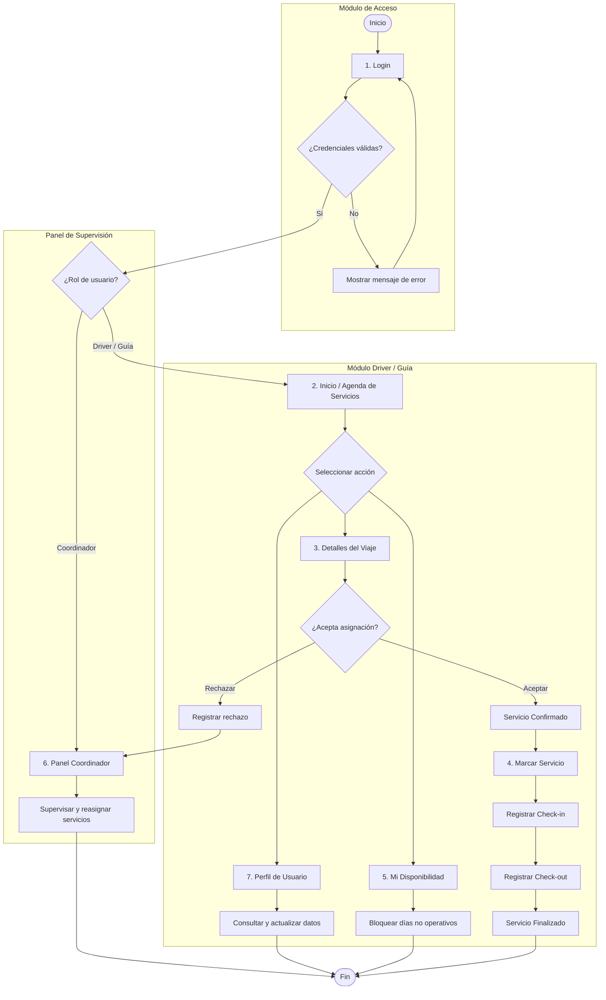

# PM Tours - PM Interactive

Prototipo y diseño de aplicación móvil para la gestión, asignación y trazabilidad de servicios turísticos de la empresa Southbound.

> **Nota:** Este repositorio documenta el avance de las fases de análisis de negocio, diseño de interfaces y arquitectura técnica para la asignatura DSY1105 (Desarrollo de Aplicaciones Móviles) en Duoc UC.

---

## Integrantes y Roles (Equipo N°7 - PM Interactive)

* **Ignacio Catalán Peralta** - Scrum Master / DevOps Engineer
* **Brayan González Muñoz** - Cloud & Backend Developer
* **Gabriel Vargas** - Product Owner / Technical Writer

* **Sección:** 003D  
* **Institución:** Duoc UC Sede Puerto Montt

---

## Contexto del Problema

Southbound gestiona traslados, excursiones y servicios guiados en Santiago, Puerto Varas y Punta Arenas. Actualmente, las asignaciones a drivers y guías se coordinan mediante llamadas telefónicas, mensajería instantánea y planillas manuales. Esto ocasiona:

* Demoras críticas en la confirmación de los servicios.
* Dispersión de la información operativa fuera del ERP.
* Falta de visibilidad en tiempo real para saber si un servicio fue aceptado, rechazado o iniciado.

---

## Identidad Visual y Diseño

* **Nombre de la App:** PM Tours
* **Logotipo:** Almacenado en `docs/assets/logo.jpg`. Representa la geografía de la zona sur (montañas, ríos y senderos) junto a la disponibilidad operativa continua (ciclo sol/luna).

### Paleta de Colores (Material Design 3)

* **Principal (`#0F3A5D`):** Barras superiores (TopAppBar), encabezados y botones primarios.
* **Secundario (`#0096C7`):** Íconos de servicios, acentos de selección y filtros activos.
* **Fondo (`#F8FAFC`):** Fondo general de alta legibilidad para uso bajo luz solar directa en terreno.
* **Texto (`#1E293B`):** Títulos, horarios de recogida e información de pasajeros con alto contraste.
* **Alerta (`#E67E22`):** Indicador de servicios en estado pendiente y avisos urgentes.
* **Éxito (`#2ECC71`):** Confirmación de servicios y registro exitoso de check-in / check-out.

---

## Flujo de Usuario (Diagrama de Actividad UML)

Representación del flujo operativo del MVP renderizado con Mermaid:



> La versión exportada en alta resolución se encuentra en `docs/diseno/flujo-usuario-uml.png`.

---

## Pantallas del MVP

Las interfaces diseñadas se ubican en la carpeta `docs/diseno/interfaces/`:

1. **Login (`Login.png`):** Autenticación diferenciada según el rol del usuario.
2. **Inicio / Agenda (`Inicio.png`):** Listado de servicios asignados con fecha, hora y origen.
3. **Detalles del Viaje (`detalles.png`):** Información completa del servicio con acciones de confirmación y rechazo.
4. **Marcar Servicio (`Checkinout.png`):** Registro operativo de Check-in y Check-out.
5. **Mi Disponibilidad (`disponibilidad.png`):** Calendario interactivo para marcar días libres o bloqueados.
6. **Panel Coordinador (`Panel_coordinacion.png`):** Vista general de estados operativos para reasignaciones inmediatas.

---

## Stack Tecnológico

* **IDE:** Android Studio
* **Lenguaje:** Kotlin
* **UI Toolkit:** Jetpack Compose con Material Design 3
* **Arquitectura:** MVVM (Model-View-ViewModel)
* **Gestor de Dependencias:** Gradle (Kotlin DSL)
* **Persistencia Local:** Room Database
* **Consumo de Red:** Retrofit (con API REST simulada)
* **Asincronía:** Coroutines y StateFlow

---

## Estructura del Repositorio

```text
├── README.md
└── docs/
    ├── assets/
    │   └── logo.jpg                     # Isotipo y logotipo oficial
    ├── diseno/
    │   ├── flujo-usuario-uml.png        # Diagrama de actividad exportado
    │   └── interfaces/                  # Prototipos de pantallas en PNG
    │       ├── Checkinout.png
    │       ├── disponibilidad.png
    │       ├── detalles.png
    │       ├── Inicio.png
    │       ├── Login.png
    │       └── Panel_coordinacion.png
    └── evidencias/
        ├── clase-01/
        │   └── Evidencia_Clase_01_MVP_Equipo07.docx
        └── clase-02/
            └── Evidencia_Clase_02_Diseno_Equipo07.docx
```

---

## Privacidad de la Información

Proyecto de carácter estrictamente académico. No se utilizan credenciales productivas, bases de datos internas ni datos personales o sensibles de trabajadores y clientes de Southbound. Todos los registros son ficticios y anonimizados.